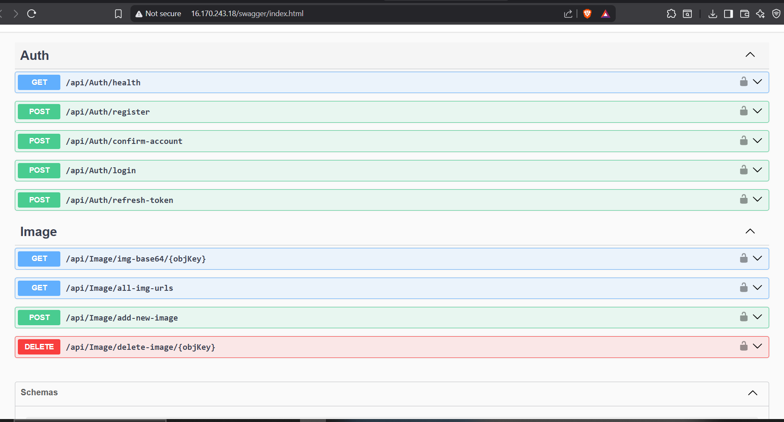

# PicHub - Image Repository API

This is a monolithic API for storing and managing images. It is built with **ASP.NET Core** and runs on **AWS EC2**. The app uses **AWS Cognito** for login, **Amazon S3** for image storage, and **Swagger UI** for testing. The app is containerized with Docker and deployed using **Terraform** and **GitHub Actions**.

---

## Features

- User login and access control (via **AWS Cognito**)
- Upload, view, and delete images (stored in **S3**)
- Swagger UI for easy testing
- Docker support
- Deployed to **EC2** using **ECR**, **Terraform**, and **GitHub Actions**

---

## Swagger UI

